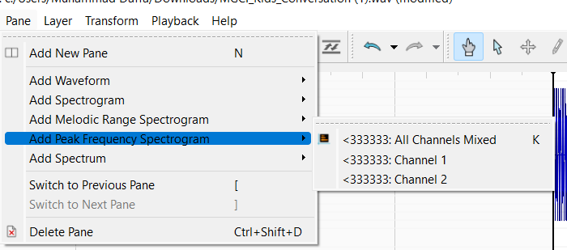

# WxMCTF Forensics 2 - Sneaky Spying
> Shhh, don't tell the MGCI kids, but I spied on one of their conversations! Uhh, I couldn't really understand what they were saying though. Can you let me you what they said? -For educational purposes of course.

> Oh, they also had this open on their phones. I don't know what to make of it though: https://pages.mtu.edu/~suits/notefreqs.html

> Enter any letter characters inside the flag as upper case (e.g: wxmctf{H3LLO})

## About the Challenge
We were given a `wav` file (You can download the file [here](MGCI_Kids_Conversation.wav))and we need to find the music notes

## How to Solve?
To get the flag you can use `Sonic Visualizer` and add a new pane called `Peak Frequency Spectogram`



Hover your mouse over the yellow light to get an alphabet such as (ABCDEFG) and repeat for each note


```
wxmctf{DECAFE}
```