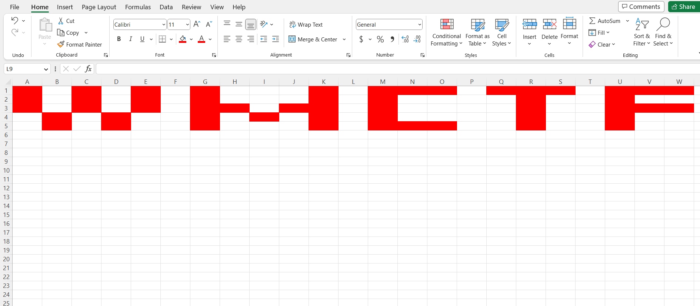

# WxMCTF Forensics 3 - ART
> Pshhh, who needs drawing software to make their art? I have coding skills, let me prove it!

> All letters in the flag are uppercase, including the WXMCTF{} part.

## About the Challenge
We have been given a VBA code and you can run it on the excel (You can download the file [here](ART_iAugUZ2.txt))

## How to Solve?
To get the flag you need to run the VBA code by using `Alt + F11` (Actually you need to recode a little bit about the VBA code but I forgot to save the recoded code... ) After you recoded the VBA code, the excel will look like this



```
WXMCTF{3XC3LL1NG_1N_4RT_10F2C}
```