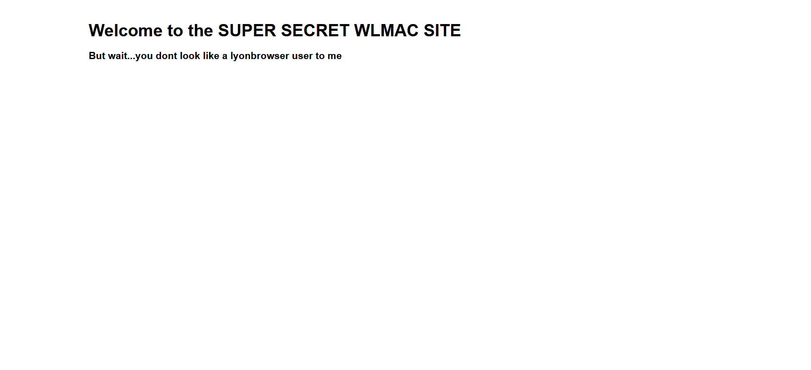
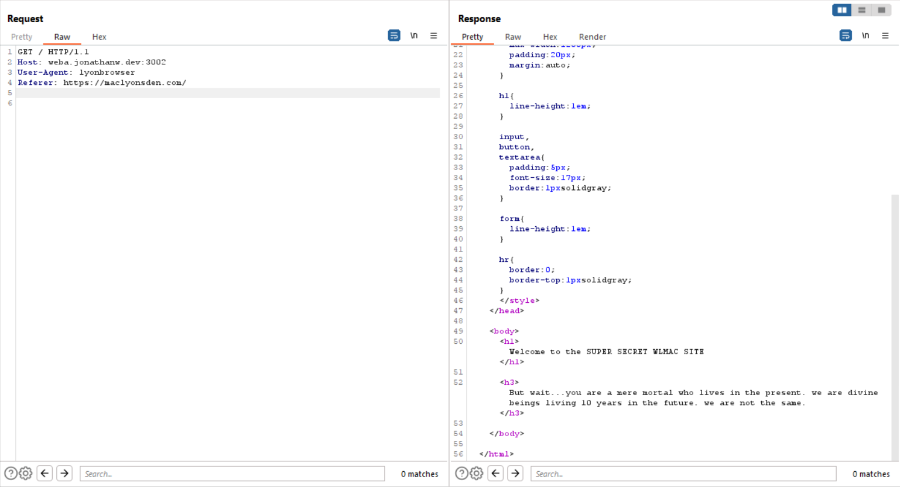

# WxMCTF Web 2 - Restricted Access
> Legend has it that WLMAC has a super duper secret website, currently being used to plot attacks against MGCI...

> Access the challenge right here: https://weba.jonathanw.dev:3002/

## About the Challenge
We have been given a website and we need to change some headers to get the flag



## How to Solve?
First, you need to change the `User-Agent` header to `lyonbrowser`


And then you need to add a header called `Referer` and the value is `https://maclyonsden.com/`



And then you need to add a header called `Date` and the value is `2043`


Add another header called `Upgrade-Insecure-Requests` and the value is `1`


And the last one you need a header called `Downtime` and set the value into a big number for example 99999999999


```
wxmctf{s3cret_sit3_http_head3rs_r_c0o1}
```