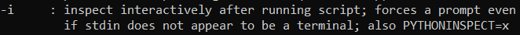
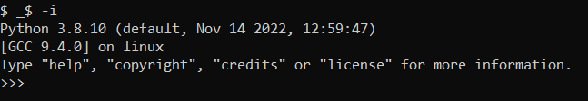

# abhs
> Just a warmup.

> nc abhs.bctf23-codelab.kctf.cloud 1337

## About the Challenge
We were given a server. But if we input a command, the server will sort the characters. For example the command `bash`, then the server will execute it as `absh`

## How to Solve?
First, we try to execute `env` command and the result is


As you can see there is an interesting environment variable called `_` and the value is `/usr/bin/python3`

If we input `_$` on the server. The server will be executing a `/usr/bin/python3`


But we still can't do anything, we will force the python to open a prompt using `-i` switches



Now we input `_$ -i` into the server and the result is



You can import `os` package to run OS command without any restriction


```
bctf{gr34t_I_gu3ss_you_g0t_that_5orted_out:P}
```