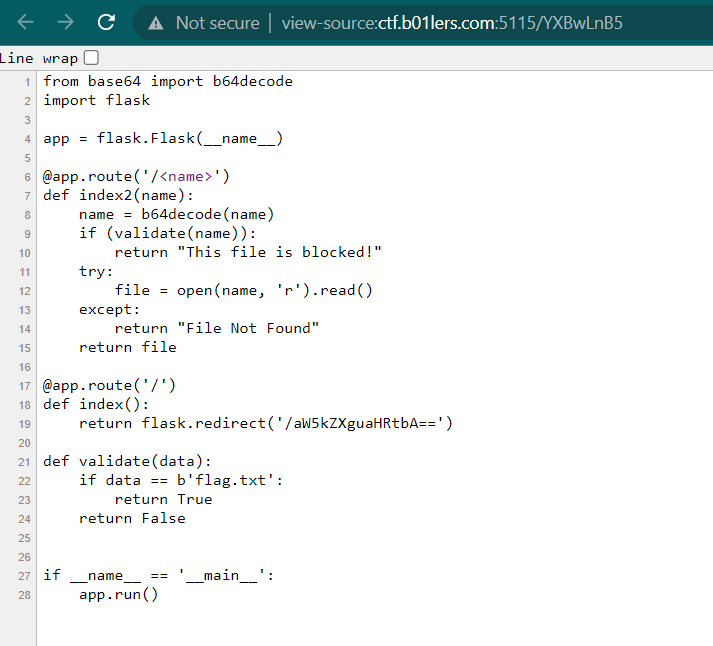

# warmup
> My first flask app, I hope you like it

## About the Challenge
We have been given a website without source code


## How to Solve?
If we check the source, code there is another endpoint called `debug.html`


And if we decode `aW5kZXguaHRtbA==` we will get `index.html`. Now change it from `index.html` to `debug.html` and encode it with `base64`


Now we got another file called `app.py`. Now, try to access app.py endpoint (Dont forget to encode the name again)



As you can see the flag is located in `flag.txt` endpoint. But we can't access it directly because there is a function called `validate` to detect if our input is `flag.txt` or not

```python
def validate(data):
    if data == b'flag.txt':
        return True
    return False
```

To bypass that, we need to add `./` on the endpoint. For example from `flag.txt` to `./flag.txt`. And then repeat then encode the endpoint again with `base64` and you will get the flag


```
bctf{h4d_fun_w1th_my_l4st_m1nut3_w4rmuP????!}
```