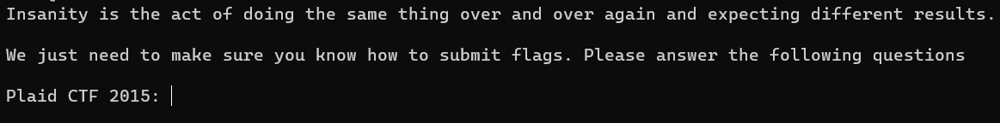

# Insanity Check
> Hello and welcome to cursed ctf for real. glad you read the rules lets go.

## About the Challenge
We have been given a server to connect and we need to find the `sanity check` flag from each CTF competition



## How to Solve?
To solve this chall, you need to find the information about some CTF competition. For example `Plaid CTF 2014:`, I can get information about the flag using `ctftime` or you can search it in Github or you can find the flag by reading someone's writeup


```
cursed{w3lc0m3_t0_th3_sh1tsh0w!}
```