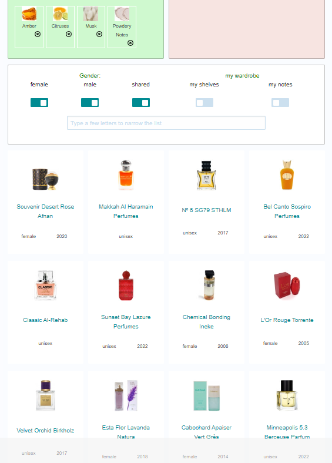

# Scents^2
> What's the common notes for all of these scents?


## About the Challenge
We have received a list of perfumes, and we need to find the correct ingredient / notes

## How to Solve?
Im using this [website](https://www.fragrantica.com/ingredients-search/) to find the correct notes. And then I tried to search each perfume and here is the list

* https://www.fragrantica.com/perfume/Al-Rehab/Classic-20062.html
* https://www.fragrantica.com/perfume/Lazure-Perfumes/Sunset-Bay-75321.html
* https://www.fragrantica.com/perfume/Ineke/Chemical-Bonding-4070.html
* https://www.fragrantica.com/perfume/Torrente/L-Or-Rouge-2468.html
* https://www.fragrantica.com/perfume/Birkholz/Velvet-Orchid-59877.html
* https://www.fragrantica.com/perfume/Natura/Esta-Flor-Lavanda-58164.html
* https://www.fragrantica.com/perfume/Gres/Cabochard-Apaiser-Vert-35966.html
* https://www.fragrantica.com/perfume/Berceuse-Parfum/Minneapolis-5-3-75704.html

Scroll down a little bit, and you will find the perfumes notes. Find the same ingredients in all perfumes, for example, `amber` and `citruses`. And then input all the ingredients on the ingredient searcher



```
cursed{amber,citruses,musk,powdery notes}
```