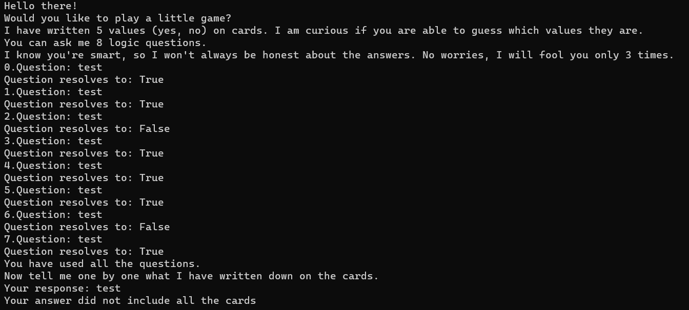

# ECC for dummies
> Sometimes you have to force logic to do what you want it to do

## About the Challenge
We were given a server to connect and also the source code. So we can input 8 questions and we need to guess the cards too (You can download the source code [here](ecc_for_dummies.zip))



## How to Solve?
To solve this chall, im using PyJail payload and I inputted it when the bot asked us to input the question

```
breakpoint()
```

After enterring Python debugger, run this command to obtain the flag

```
open("/jailed/flag.txt").read()
```


```
justCTF{S4nd_S0metim3s_It$_EvEn_$0lv4ble}
```