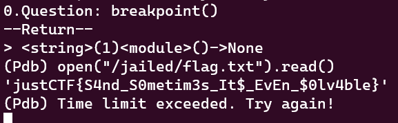

# ECC not only for Dummies
> This time you will need to use all logic that you have

## About the Challenge
We have been given a server to connect and also the source code. So we can input 8 questions and we need to guess the cards too (You can download the source code [here](ecc_not_only_for_dummies.zip))


## How to Solve?
To solve this chall, im using PyJail payload and I inputted it when the bot asked us to input the question

```
breakpoint()
```

After enterring Python debugger, run this command to obtain the flag

```
open("/jailed/flag.txt").read()
```



```
justCTF{S4nd_S0metim3s_It$_EvEn_$0lv4ble}
```