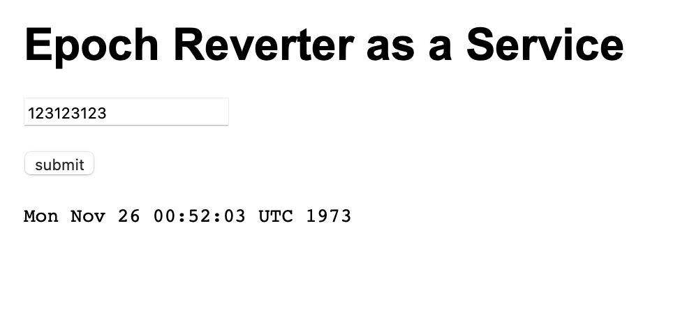
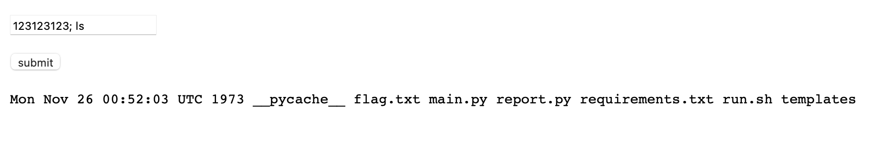
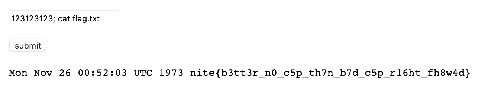

# ERaaS
> Emergency response? Afraid not

## About the Challenge
We were given a website without the source code, where the website only has one functionality: converting the epoch to date.



## How to Solve?
The website is vulnerable to OS Command Injection through the addition of `;` after the epoch, followed by the command you want to execute





```
HackTM{Timisoara}
```