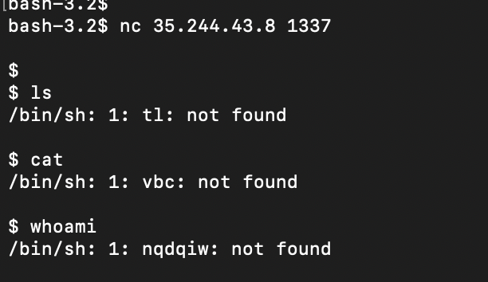
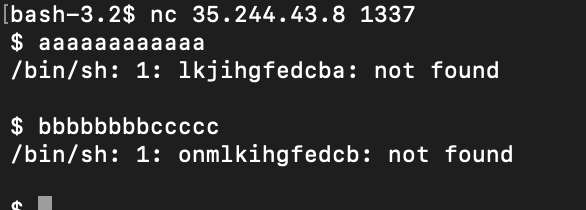
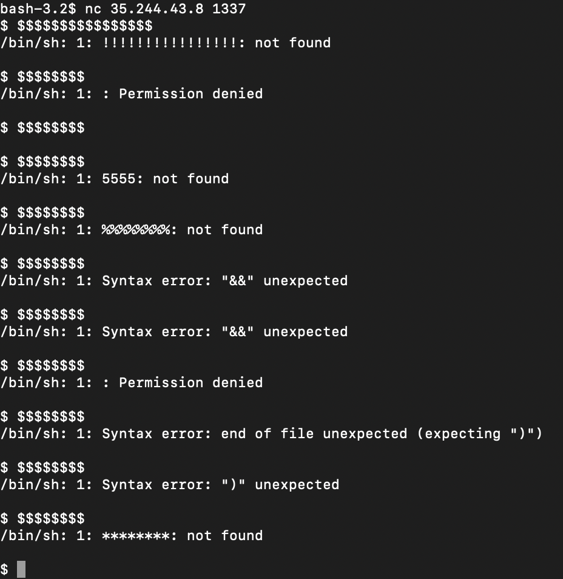
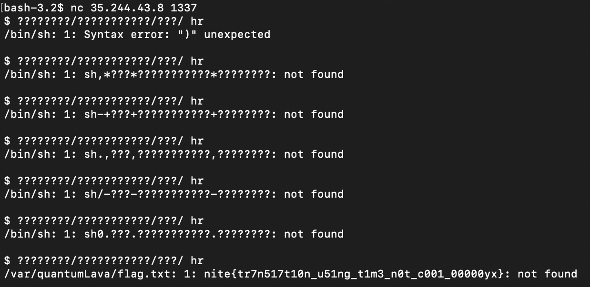

# German shell
> Do you have an Albert Einstein in you? If not you better find one cuz you gonna need em else you gunna faint rottin

> /var/quantumLava/flag.txt

## About the Challenge
We were given a server to connect without any attachment, and in this server we can execute bash command but the output is a little bit weird



## How to Solve?
After trying some random comments, I just realize there's a "pattern"



As we can see here, the program will reverse the results of our input and also substract -1 to each character we input. For example here, i want to execute `cat` command:

```
1. Reverse cat -> tac
2. Minus -1 character for every character
t - 0 = t
a - 1 = z
c - 2 = a
3. To execute `cat`, we need to input `tac`
```

But this doesn't apply to special character because they always changed the character every second



And to read the flag, luckily the program didn't change character `?` every second so the final payload will looks like this

```
????????/???????????/???/ hr
```

Means I want to execute

```
sh /???/???????????/????????
```



> we need to input this command multiple times because the program change `/` into a random character

```
nite{tr7n517t10n_u51ng_t1m3_n0t_c001_00000yx}
```