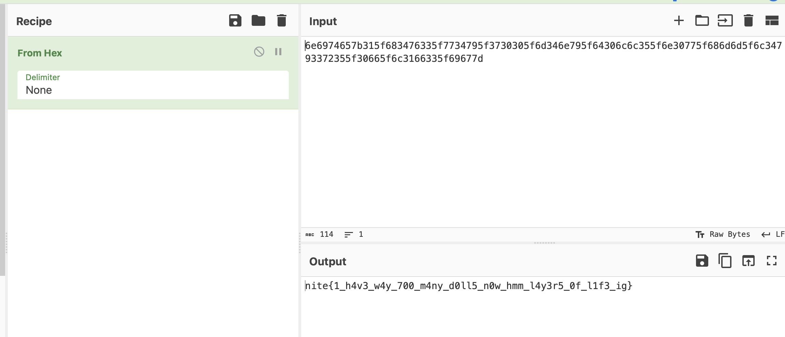

# Matryoshka
> : I think we should have a matryoshka challenge..

> : Sure! Go ahead.

> : Let's make it different this time. HEhe!

> : *-+

## About the Challenge
We were given a txt file containing a base64 encoded message

## How to Solve?
First we need to decode the encoded text with some steps:
* Base64
* Hex
* Decimal
* Hex


And we got an image! Now, I tried to upload the image to Aperisolve and used `foremost` to extract a file inside the image. And we got 3 files here:

* The original image
* Another png file
* A zip file

When I opened the zip file, it turns out this file is useless.


And then i tried to analyze the `.png` file, after using `binwalk`, `foremost`, `LSB steganography`, etc. sadly I got nothing here. But when I used `Extract RGBA` options (CyberChef), we got another image again!


I uploaded the image to Aperisolve and there's a zip archive file inside the image


Inside the zip file, there is a file called `arc.tar.gz` and if you `gunzip` it, you got a compiled binary file


Reverse engineer the code and there's a hex code inside of it


Assemble the hex data then insert them into CyberChef and you got a `class` file


Decompile the file, and you got this java program

```java
import java.util.ArrayList;
import java.util.Collections;
import java.util.HashMap;

public class nite {
   public static String convertString(String var0) {
      ArrayList var1 = new ArrayList();
      char[] var2 = var0.toCharArray();
      int var3 = var2.length;

      int var4;
      for(var4 = 0; var4 < var3; ++var4) {
         char var5 = var2[var4];
         var1.add(var5);
      }

      Collections.shuffle(var1);
      HashMap var9 = new HashMap();
      char[] var10 = var0.toCharArray();
      var4 = var10.length;

      int var13;
      for(var13 = 0; var13 < var4; ++var13) {
         char var6 = var10[var13];
         var9.put(var6, (Character)var1.remove(0));
      }

      StringBuilder var11 = new StringBuilder();
      char[] var12 = var0.toCharArray();
      var13 = var12.length;

      for(int var14 = 0; var14 < var13; ++var14) {
         char var7 = var12[var14];
         char var8 = (Character)var9.getOrDefault(var7, var7);
         var11.append(var8);
      }

      return var11.toString();
   }

   private static String convert(String var0) {
      StringBuilder var1 = new StringBuilder();

      for(int var2 = 0; var2 < var0.length(); var2 += 2) {
         String var3 = var0.substring(var2, var2 + 2);
         int var4 = Integer.parseInt(var3, 16);
         var1.append((char)var4);
      }

      return var1.toString();
   }

   public static void main(String[] var0) {
      String var1 = "686d6d5f6c34793372355f";
      String var2 = "76335f7734795f3730305f6d346e79";
      String var3 = "6e6974657b315f6834";
      String var4 = "5f64306c6c355f6e30775f";
      String var5 = "30665f6c3166335f69677d";
      String var6 = convert(var3 + var2 + var4 + var1 + var5);
      String var7 = convertString(var6);
      System.out.println("1_h4t3_str1ng_m4n1pul4710n_1n_java: " + var7);
   }
}
```

Remove the `convert()` and `convertString()` command and you got the final hex code




```
nite{1_h4v3_w4y_700_m4ny_d0ll5_n0w_hmm_l4y3r5_0f_l1f3_ig}
```