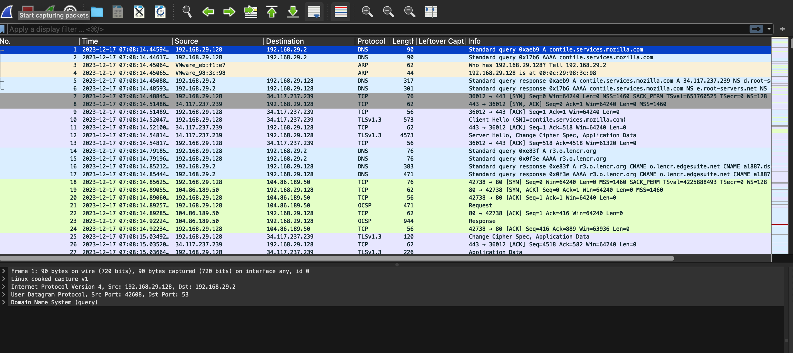
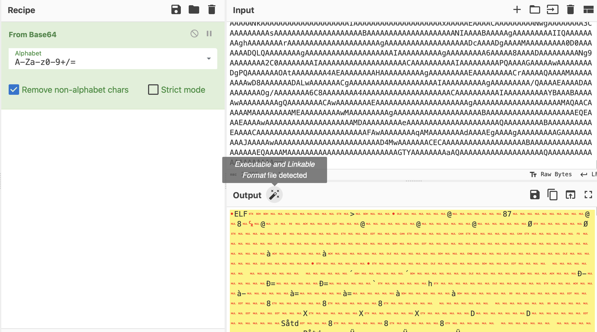
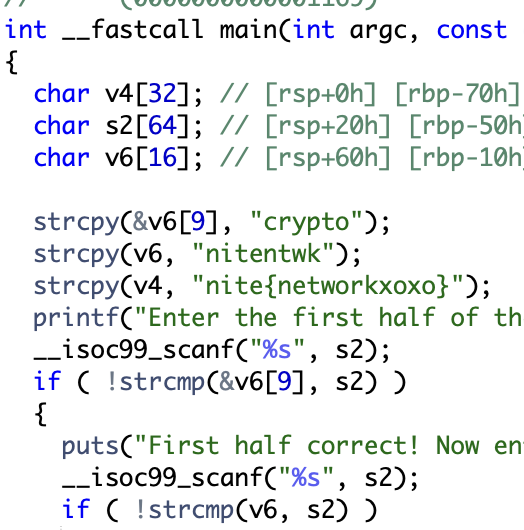

# cheval de troie
> After accessing our private network, the hacker skillfully maneuvered through files, leaving behind a virtual trail of mystery. We managed to capture the packets, exposing the encrypted breadcrumbs scattered across the network. Before slipping away into the digital abyss, the intruder left a deliberate hint—a cryptic message that conceals the essence of their next move. Decrypt the message and unveil the obscured 'crypto' to thwart their cunning plan.

> Taupe will be visible after this challenge

## About the Challenge
We were given a `pcapng` file (You can download the file [here](initial-report.pcapng)). And here is the preview of the packet capture file



## How to Solve?
There's an interesting encoded base64 message in stream 33


I copied the msg and then use cyberchef to decode it



Reverse engineer the program to obtain th eflag



```
nite{networkxoxo}
```