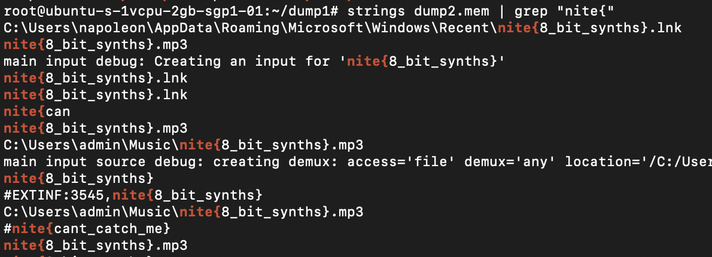

# coup de réseau
> Too late. The network admin's system was compromised and we can't access our network anymore. Investigate the memory dump.

> Memory Dump Link: https://drive.google.com/file/d/1LbElkzno-FophYpkTLPL5ic2BnZgn-UN/view?usp=sharing

> Amour Plastique will be visible after solving this challenge.

## About the Challenge
We were given a dump memory file called `dump2.mem` and we need investigate the memory dump file

## How to Solve?
In this case im using `strings` and `grep` to get the flag



```
nite{8_bit_synths}
```