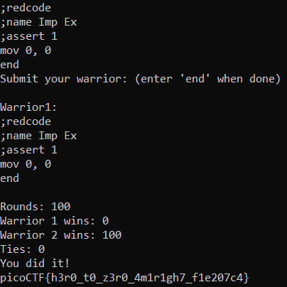

# Ready Gladiator 0
> Can you make a CoreWars warrior that always loses, no ties?

## About the Challenge
We have been given a file called `imp.red` (You can download the file [here](imp.red)) and we need to find a way to make the `Warrior 1` lose


Also here is the content of `imp.red`

```
;redcode
;name Imp Ex
;assert 1
mov 0, 1
end
```

The code will move the value `1` to register `0`

## How to Solve?
Actually i don't know anything about `CoreWars` code but to solve this I just changed the from value `1` to value `0` to obtain the flag

```
;redcode
;name Imp Ex
;assert 1
mov 0, 0
end
```

And luckily I got the flag



```
picoCTF{h3r0_t0_z3r0_4m1r1gh7_f1e207c4}
```