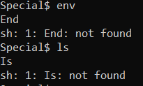

# Special
> Don't power users get tired of making spelling mistakes in the shell? Not anymore! Enter Special, the Spell Checked Interface for Affecting Linux. Now, every word is properly spelled and capitalized... automatically and behind-the-scenes! Be the first to test Special in beta, and feel free to tell us all about how Special streamlines every development process that you face. When your co-workers see your amazing shell interface, just tell them: That's Special (TM)

## About the Challenge
We have been given an access to SSH server and we need to find the flag in the server (But there is an autocorrect if we input some commands)



## How to Solve?
To solve this chall, im using `$()`, so here is the command that I used

```shell
$(ls)
$(cat<blargh/flag.txt)
```

First im using `ls` command to find where is the flag, and then there is a directory called `blargh` and then im trying to open the flag using `cat` command inside `blargh` directory


```
picoCTF{5p311ch3ck_15_7h3_w0r57_f906e25a}
```