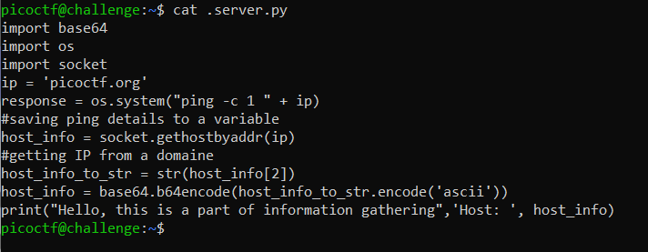
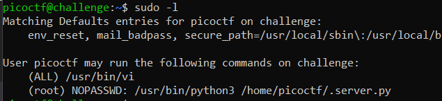
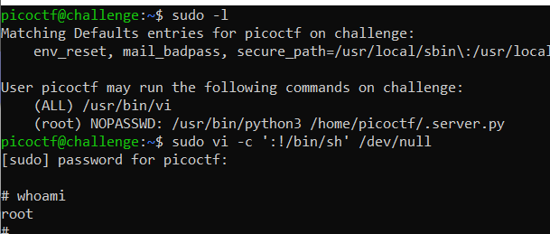

# hijacking
> Getting root access can allow you to read the flag. Luckily there is a python file that you might like to play with.

> Additional details will be available after launching your challenge instance.

## About the Challenge
We have been given an access to SSH server and then there is a file called `.server.py` and if we check the content of the file



## How to Solve?
Im using unintended way to solve this chall, because if we check the `sudo` configuration



There are 2 following commands that we can use, `/usr/bin/vi` or file `.server.py`. In this case im using `/usr/bin/vi` command to do privilege escalation (Im using [GTFOBins](https://gtfobins.github.io/gtfobins/vi/#sudo) to do privilege escalation)



And then go to `/root` directory and read `.flag.txt` to obtain the flag


```
picoCTF{pYth0nn_libraryH!j@CK!n9_13cfd3cc}
```