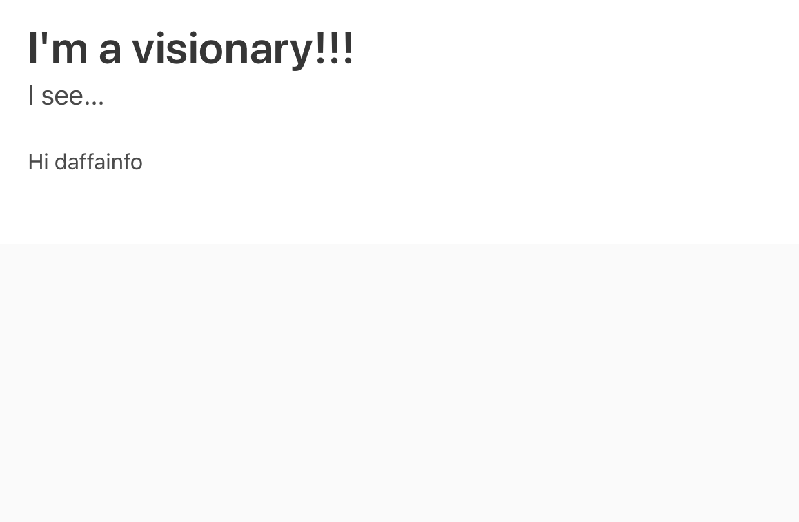
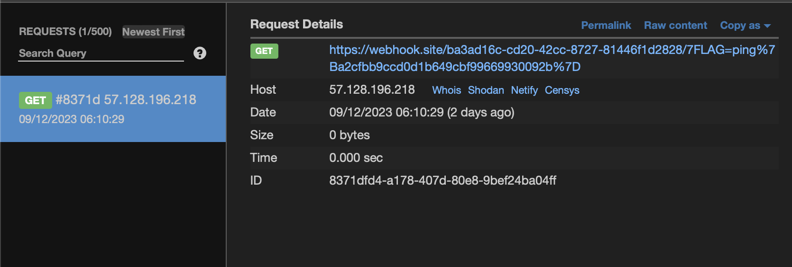

# i-see-no-vulnerability
> With AI we are entering a new era! Join us in this exciting journey with our visionary app!

> When solving this challenge a new one will be unlocked which is a sequel to this one.

## About the Challenge
We were given a website and a source code (You can download the source code [here](1c24ae229fff8eb7ac53c1252e52b12e.zip)). And this website has a functionality where the uploaded images will be read using OCR, and if text is found in the image, the text will be displayed on the website.


This is when I uploaded a photo containing the text `Hi daffainfo`



## How to Solve?
If you look at the source code, our input will go into a script HTML tag and div tag

```html
<head>
    <meta charset="UTF-8" />
    <meta name="viewport" content="width=device-width, initial-scale=1" />
    <title>Image {{IMAGE}}</title>
    <link
        rel="stylesheet"
        href="https://cdn.jsdelivr.net/npm/bulma@0.9.4/css/bulma.min.css" />
</head>
<body>
    <section class="hero">
        <div class="hero-body">
            <p class="title">I'm a visionary!!!</p>
            <p class="subtitle">I see...</p>
            <div id="vision">{{VISION_TEXT}}</div>
        </div>
    </section>
    <footer class="footer">
        <div class="content has-text-centered">
            <p><a href="/">Go back</a></p>
            <p>
                NSFW? <form method="post" action="/report/{{IMAGE}}"><input type="submit" value="Click here to report" class="button" /></form>
            </p>
        </div>
    </footer>
    <script>
        const text = "{{VISION_TEXT}}";
        if (text.length === 0) {
            vision.innerHTML = "";
        }
    </script>
</body
```

And because the program filters image text using `DOMPurify`, we cannot use HTML tags to perform XSS, so we cannot place an XSS payload in `div` tags, and the other option is to place the XSS payload in `script` tags.

```javascript
app.get("/result/:uuid", (req, res) => {
	const { uuid } = req.params;
	if (isValidUUID(uuid)) {
		const unsafe_text = visionedDict[uuid];
		if (unsafe_text === undefined) {
			return res.redirect("/");
		}
		const text = DOMPurify.sanitize(unsafe_text);
		const page = readFileSync("./templates/result.html", "utf8")
			.replaceAll("{{VISION_TEXT}}", text)
			.replaceAll("{{IMAGE}}", uuid);
		res.send(page);
	} else {
		res.status(400).send("Invalid UUID");
	}
});
```

This is the final payload I used to obtain the flag:


Upload the image and then press the report button



```
ping{a2cfbb9ccd0d1b649cbf99669930092b}
```