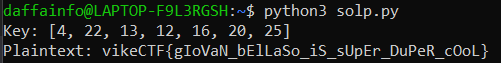

# Berserker's Brain Teaser
> Welcome to the "Berserker's Brain Teaser" challenge! The Vikings were known for their fearless and frenzied warriors called berserkers, and this challenge will require you to channel your inner berserker to solve a cryptogram. Can you break the code and decipher the message to claim victory?

> zexqSNE{cVaLuM_xRxBuRs_vE_mTtAe_ToOiN_oEiK}

## About the Challenge
We were given a python file (You can download the file [here](BerserkerBrainTeaserEncrypt.py)) and we need to decrypt the flag

## How to Solve?
If we check the python script

```python
import random

alphabet = "abcdefghijklmnopqrstuvwxyz"

plaintext = input("text to encrypt:\n")
ciphertext = ""

key = [random.randint(1, len(alphabet)) for _ in range(len("vikeCTF"))]
print("key:", *key)

for i, c in enumerate(plaintext):
	if not c.isalpha():
		ciphertext += c
		continue

	offset = alphabet.find(c.lower())
	rotation = key[i % len(key)]

	result = alphabet[(offset + rotation) % len(alphabet)]
	if c.islower():
		ciphertext += result
	else:
		ciphertext += result.upper()

print("ciphertext:")
print(ciphertext)
```

This Python script encrypts a user-provided message using a substitution cipher, which involves shifting each letter in the plaintext by a certain amount based on a randomly generated key. The key is a sequence of random integers between 1 and the length of the alphabet, which is repeated cyclically to match the length of the plaintext. The resulting encrypted message is printed to the console.

Because we know the key is very short, we can bruteforce the key until we know the actual key. I have created python script to do this job

```python
import random

alphabet = "abcdefghijklmnopqrstuvwxyz"

ciphertext = "zexqSNE{cVaLuM_xRxBuRs_vE_mTtAe_ToOiN_oEiK}"
plaintext = ""

for key in range(1, 27):
    new_key = [key, 1, 1, 1, 1, 1, 1]
    for i, c in enumerate(ciphertext):
        if not c.isalpha():
            plaintext += c
            continue

        offset = alphabet.find(c.lower())
        rotation = new_key[i % len(new_key)]

        result = alphabet[(offset - rotation) % len(alphabet)]
        if c.islower():
            plaintext += result
        else:
            plaintext += result.upper()

    print(f"Key: {new_key}")
    print(f"Plaintext: {plaintext}")
    plaintext = ""
```

Run the program multiple times while shifting the key to obtain the correct key. The correct key is `[4, 22, 13, 12, 16, 20, 25]`



```
vikeCTF{gIoVaN_bElLaSo_iS_sUpEr_DuPeR_cOoL}
```