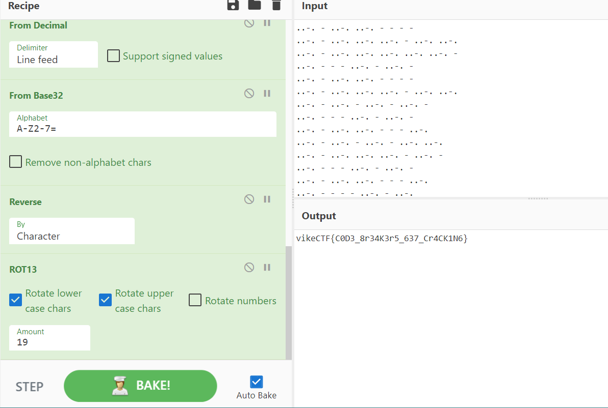

# Cipher Cracking
> I've been sitting here for days, listening to the radio and writing down dots and dashes. I'm starting to feel like one of those old-timey codebreakers, you know? To be honest, I have no idea what it all means! Think you can help me out?

## About the Challenge
We have been given a file (You can download the file [here](1N73rC3P710N.enc)). If we check the file, the file contain some morse code


## How to Solve?
For this chall, I only using CyberChef there are some operation that can you use in CyberChef:
* From morse code to ASCII
* Change the character (F == 0 and T == 1)
* From binary
* From base64
* Remove the dot using `split`
* From decimal to ASCII
* From base32
* Reverse the text
* The last one is caesar cipher (Shifted 19 characters)

You can also access the link below to see the decryption process

```
https://gchq.github.io/CyberChef/#recipe=From_Morse_Code('Space','Line%20feed')Find_/_Replace(%7B'option':'Regex','string':'F'%7D,'0',true,false,true,false)Find_/_Replace(%7B'option':'Regex','string':'T'%7D,'1',true,false,true,false)From_Binary('Space',8)From_Base64('A-Za-z0-9%2B/%3D',true,false)Split('.','%5C%5Cn')From_Decimal('Line%20feed',false)From_Base32('A-Z2-7%3D',false)Reverse('Character')ROT13(true,true,false,19)&input=Li4tLiAtIC4uLS4gLi4tLiAtIC0gLSAtCi4uLS4gLSAuLi0uIC4uLS4gLi4tLiAtIC4uLS4gLi4tLgouLi0uIC0gLi4tLiAuLi0uIC4uLS4gLi4tLiAuLi0uIC0KLi4tLiAtIC0gLSAuLi0uIC0gLi4tLiAtCi4uLS4gLSAuLi0uIC4uLS4gLSAtIC0gLQouLi0uIC0gLi4tLiAuLi0uIC4uLS4gLSAuLi0uIC4uLS4KLi4tLiAtIC4uLS4gLSAuLi0uIC0gLi4tLiAtCi4uLS4gLSAtIC0gLi4tLiAtIC4uLS4gLQouLi0uIC0gLi4tLiAuLi0uIC0gLSAtIC4uLS4KLi4tLiAtIC4uLS4gLSAuLi0uIC0gLi4tLiAuLi0uCi4uLS4gLSAuLi0uIC4uLS4gLi4tLiAtIC4uLS4gLQouLi0uIC0gLSAtIC4uLS4gLSAuLi0uIC0KLi4tLiAtIC4uLS4gLi4tLiAtIC0gLSAuLi0uCi4uLS4gLSAtIC0gLSAuLi0uIC0gLi4tLgouLi0uIC0gLi4tLiAuLi0uIC4uLS4gLi4tLiAuLi0uIC0KLi4tLiAtIC0gLSAuLi0uIC0gLi4tLiAtCi4uLS4gLSAuLi0uIC4uLS4gLSAtIC0gLi4tLgouLi0uIC0gLSAtIC0gLi4tLiAtIC4uLS4KLi4tLiAtIC4uLS4gLSAuLi0uIC0gLi4tLiAtCi4uLS4gLSAtIC0gLi4tLiAtIC4uLS4gLQouLi0uIC0gLi4tLiAuLi0uIC0gLSAtIC4uLS4KLi4tLiAtIC0gLSAtIC4uLS4gLSAuLi0uCi4uLS4gLSAtIC4uLS4gLi4tLiAuLi0uIC0gLQouLi0uIC0gLSAtIC4uLS4gLSAuLi0uIC0KLi4tLiAtIC4uLS4gLi4tLiAtIC0gLSAuLi0uCi4uLS4gLSAtIC0gLSAuLi0uIC0gLi4tLgouLi0uIC0gLi4tLiAtIC4uLS4gLSAuLi0uIC0KLi4tLiAtIC0gLSAuLi0uIC0gLi4tLiAtCi4uLS4gLSAuLi0uIC4uLS4gLSAtIC0gLQouLi0uIC0gLi4tLiAuLi0uIC4uLS4gLSAuLi0uIC4uLS4KLi4tLiAtIC4uLS4gLi4tLiAtIC0gLi4tLiAtCi4uLS4gLSAtIC0gLi4tLiAtIC4uLS4gLQouLi0uIC0gLi4tLiAuLi0uIC0gLSAtIC4uLS4KLi4tLiAtIC0gLSAtIC4uLS4gLSAuLi0uCi4uLS4gLSAuLi0uIC0gLi4tLiAuLi0uIC4uLS4gLQouLi0uIC0gLSAtIC4uLS4gLSAuLi0uIC0KLi4tLiAtIC4uLS4gLi4tLiAtIC0gLSAuLi0uCi4uLS4gLSAtIC0gLSAuLi0uIC0gLi4tLgouLi0uIC0gLi4tLiAuLi0uIC0gLSAuLi0uIC0KLi4tLiAtIC0gLSAuLi0uIC0gLi4tLiAtCi4uLS4gLSAuLi0uIC4uLS4gLSAtIC0gLi4tLgouLi0uIC0gLi4tLiAtIC4uLS4gLSAuLi0uIC4uLS4KLi4tLiAtIC4uLS4gLi4tLiAuLi0uIC4uLS4gLi4tLiAtCi4uLS4gLSAtIC0gLi4tLiAtIC4uLS4gLQouLi0uIC0gLi4tLiAuLi0uIC0gLSAtIC4uLS4KLi4tLiAtIC0gLSAtIC4uLS4gLSAuLi0uCi4uLS4gLSAuLi0uIC4uLS4gLSAuLi0uIC4uLS4gLQouLi0uIC0gLSAtIC4uLS4gLSAuLi0uIC0KLi4tLiAtIC4uLS4gLi4tLiAtIC0gLSAtCi4uLS4gLSAuLi0uIC4uLS4gLi4tLiAtIC4uLS4gLi4tLgouLi0uIC0gLi4tLiAuLi0uIC0gLSAuLi0uIC0KLi4tLiAtIC0gLSAuLi0uIC0gLi4tLiAtCi4uLS4gLSAuLi0uIC4uLS4gLSAtIC0gLQouLi0uIC0gLi4tLiAuLi0uIC4uLS4gLSAuLi0uIC4uLS4KLi4tLiAtIC4uLS4gLi4tLiAtIC0gLi4tLiAtCi4uLS4gLSAtIC0gLi4tLiAtIC4uLS4gLQouLi0uIC0gLi4tLiAuLi0uIC0gLSAtIC0KLi4tLiAtIC4uLS4gLi4tLiAuLi0uIC0gLi4tLiAuLi0uCi4uLS4gLSAuLi0uIC4uLS4gLSAtIC4uLS4gLQouLi0uIC0gLSAtIC4uLS4gLSAuLi0uIC0KLi4tLiAtIC4uLS4gLi4tLiAtIC0gLSAuLi0uCi4uLS4gLSAuLi0uIC0gLi4tLiAtIC4uLS4gLi4tLgouLi0uIC0gLi4tLiAtIC4uLS4gLSAuLi0uIC0KLi4tLiAtIC0gLSAuLi0uIC0gLi4tLiAtCi4uLS4gLSAuLi0uIC4uLS4gLSAtIC0gLi4tLgouLi0uIC0gLSAtIC0gLi4tLiAtIC4uLS4KLi4tLiAtIC4uLS4gLi4tLiAuLi0uIC0gLi4tLiAtCi4uLS4gLSAtIC0gLi4tLiAtIC4uLS4gLQouLi0uIC0gLi4tLiAuLi0uIC0gLSAtIC4uLS4KLi4tLiAtIC4uLS4gLSAuLi0uIC0gLi4tLiAuLi0uCi4uLS4gLSAuLi0uIC4uLS4gLSAuLi0uIC4uLS4gLQouLi0uIC0gLSAtIC4uLS4gLSAuLi0uIC0KLi4tLiAtIC4uLS4gLi4tLiAtIC0gLSAtCi4uLS4gLSAuLi0uIC0gLi4tLiAtIC4uLS4gLi4tLgouLi0uIC0gLi4tLiAuLi0uIC4uLS4gLi4tLiAuLi0uIC0KLi4tLiAtIC0gLSAuLi0uIC0gLi4tLiAtCi4uLS4gLSAuLi0uIC4uLS4gLSAtIC0gLQouLi0uIC0gLi4tLiAuLi0uIC4uLS4gLSAuLi0uIC4uLS4KLi4tLiAtIC4uLS4gLSAuLi0uIC4uLS4gLi4tLiAtCi4uLS4gLSAtIC0gLi4tLiAtIC4uLS4gLQouLi0uIC0gLi4tLiAuLi0uIC0gLSAtIC4uLS4KLi4tLiAtIC0gLSAtIC4uLS4gLSAuLi0uCi4uLS4gLSAtIC4uLS4gLi4tLiAuLi0uIC0gLQouLi0uIC0gLSAtIC4uLS4gLSAuLi0uIC0KLi4tLiAtIC4uLS4gLi4tLiAtIC0gLSAtCi4uLS4gLSAuLi0uIC4uLS4gLi4tLiAtIC4uLS4gLi4tLgouLi0uIC0gLSAuLi0uIC4uLS4gLSAtIC0KLi4tLiAtIC0gLSAuLi0uIC0gLi4tLiAtCi4uLS4gLSAuLi0uIC4uLS4gLSAtIC0gLQouLi0uIC0gLi4tLiAtIC4uLS4gLSAuLi0uIC4uLS4KLi4tLiAtIC4uLS4gLi4tLiAuLi0uIC4uLS4gLi4tLiAtCi4uLS4gLSAtIC0gLi4tLiAtIC4uLS4gLQouLi0uIC0gLi4tLiAuLi0uIC0gLSAtIC0KLi4tLiAtIC4uLS4gLi4tLiAuLi0uIC0gLi4tLiAuLi0uCi4uLS4gLSAuLi0uIC0gLSAuLi0uIC4uLS4gLQouLi0uIC0gLSAtIC4uLS4gLSAuLi0uIC0KLi4tLiAtIC4uLS4gLi4tLiAtIC0gLSAtCi4uLS4gLSAuLi0uIC4uLS4gLi4tLiAtIC4uLS4gLi4tLgouLi0uIC0gLi4tLiAuLi0uIC4uLS4gLi4tLiAuLi0uIC0KLi4tLiAtIC0gLSAuLi0uIC0gLi4tLiAtCi4uLS4gLSAuLi0uIC4uLS4gLSAtIC0gLi4tLgouLi0uIC0gLSAuLi0uIC0gLi4tLiAtIC4uLS4KLi4tLiAtIC0gLi4tLiAtIC4uLS4gLSAtCi4uLS4gLSAtIC0gLi4tLiAtIC4uLS4gLQouLi0uIC0gLi4tLiAuLi0uIC0gLSAtIC0KLi4tLiAtIC4uLS4gLSAuLi0uIC0gLi4tLiAuLi0uCi4uLS4gLSAuLi0uIC4uLS4gLi4tLiAuLi0uIC4uLS4gLQouLi0uIC0gLSAtIC4uLS4gLSAuLi0uIC0KLi4tLiAtIC4uLS4gLi4tLiAtIC0gLSAtCi4uLS4gLSAuLi0uIC4uLS4gLi4tLiAtIC4uLS4gLi4tLgouLi0uIC0gLi4tLiAtIC0gLi4tLiAuLi0uIC0KLi4tLiAtIC0gLSAuLi0uIC0gLi4tLiAtCi4uLS4gLSAuLi0uIC4uLS4gLSAtIC0gLi4tLgouLi0uIC0gLSAuLi0uIC0gLi4tLiAtIC4uLS4KLi4tLiAtIC0gLi4tLiAtIC4uLS4gLSAtCi4uLS4gLSAtIC0gLi4tLiAtIC4uLS4gLQouLi0uIC0gLi4tLiAuLi0uIC0gLSAtIC4uLS4KLi4tLiAtIC0gLSAtIC4uLS4gLSAuLi0uCi4uLS4gLSAtIC4uLS4gLi4tLiAtIC0gLQouLi0uIC0gLSAtIC4uLS4gLSAuLi0uIC0KLi4tLiAtIC4uLS4gLi4tLiAtIC0gLSAuLi0uCi4uLS4gLSAtIC4uLS4gLSAuLi0uIC0gLi4tLgouLi0uIC0gLi4tLiAtIC0gLi4tLiAuLi0uIC0KLi4tLiAtIC0gLSAuLi0uIC0gLi4tLiAtCi4uLS4gLSAuLi0uIC4uLS4gLSAtIC0gLQouLi0uIC0gLi4tLiAuLi0uIC4uLS4gLSAuLi0uIC4uLS4KLi4tLiAtIC4uLS4gLSAuLi0uIC4uLS4gLi4tLiAtCi4uLS4gLSAtIC0gLi4tLiAtIC4uLS4gLQouLi0uIC0gLi4tLiAuLi0uIC0gLSAtIC0KLi4tLiAtIC4uLS4gLi4tLiAuLi0uIC0gLi4tLiAuLi0uCi4uLS4gLSAuLi0uIC4uLS4gLi4tLiAuLi0uIC4uLS4gLQouLi0uIC0gLSAtIC4uLS4gLSAuLi0uIC0KLi4tLiAtIC4uLS4gLi4tLiAtIC0gLSAuLi0uCi4uLS4gLSAtIC4uLS4gLSAuLi0uIC0gLi4tLgouLi0uIC0gLSAuLi0uIC0gLi4tLiAtIC0KLi4tLiAtIC0gLSAuLi0uIC0gLi4tLiAtCi4uLS4gLSAuLi0uIC4uLS4gLSAtIC0gLi4tLgouLi0uIC0gLi4tLiAtIC4uLS4gLSAuLi0uIC4uLS4KLi4tLiAtIC4uLS4gLi4tLiAtIC4uLS4gLi4tLiAtCi4uLS4gLSAtIC0gLi4tLiAtIC4uLS4gLQouLi0uIC0gLi4tLiAuLi0uIC0gLSAtIC4uLS4KLi4tLiAtIC0gLSAtIC4uLS4gLSAuLi0uCi4uLS4gLSAuLi0uIC4uLS4gLi4tLiAuLi0uIC4uLS4gLQouLi0uIC0gLSAtIC4uLS4gLSAuLi0uIC0KLi4tLiAtIC4uLS4gLi4tLiAtIC0gLSAuLi0uCi4uLS4gLSAuLi0uIC0gLi4tLiAtIC4uLS4gLi4tLgouLi0uIC0gLi4tLiAtIC4uLS4gLi4tLiAuLi0uIC0KLi4tLiAtIC0gLSAuLi0uIC0gLi4tLiAtCi4uLS4gLSAuLi0uIC4uLS4gLSAtIC0gLi4tLgouLi0uIC0gLSAtIC0gLi4tLiAtIC4uLS4KLi4tLiAtIC0gLi4tLiAuLi0uIC4uLS4gLSAtCi4uLS4gLSAtIC0gLi4tLiAtIC4uLS4gLQouLi0uIC0gLi4tLiAuLi0uIC0gLSAtIC4uLS4KLi4tLiAtIC4uLS4gLSAuLi0uIC0gLi4tLiAuLi0uCi4uLS4gLSAuLi0uIC4uLS4gLi4tLiAuLi0uIC4uLS4gLQouLi0uIC0gLSAtIC4uLS4gLSAuLi0uIC0KLi4tLiAtIC4uLS4gLi4tLiAtIC0gLSAuLi0uCi4uLS4gLSAtIC0gLSAuLi0uIC0gLi4tLgouLi0uIC0gLi4tLiAtIC0gLi4tLiAuLi0uIC0KLi4tLiAtIC0gLSAuLi0uIC0gLi4tLiAtCi4uLS4gLSAuLi0uIC4uLS4gLSAtIC0gLi4tLgouLi0uIC0gLSAtIC0gLi4tLiAtIC4uLS4KLi4tLiAtIC4uLS4gLi4tLiAuLi0uIC0gLi4tLiAtCi4uLS4gLSAtIC0gLi4tLiAtIC4uLS4gLQouLi0uIC0gLi4tLiAuLi0uIC0gLSAtIC4uLS4KLi4tLiAtIC0gLi4tLiAtIC4uLS4gLSAuLi0uCi4uLS4gLSAuLi0uIC0gLSAuLi0uIC4uLS4gLQouLi0uIC0gLSAtIC4uLS4gLSAuLi0uIC0KLi4tLiAtIC4uLS4gLi4tLiAtIC0gLSAuLi0uCi4uLS4gLSAtIC0gLSAuLi0uIC0gLi4tLgouLi0uIC0gLi4tLiAuLi0uIC4uLS4gLi4tLiAuLi0uIC0KLi4tLiAtIC0gLSAuLi0uIC0gLi4tLiAtCi4uLS4gLSAuLi0uIC4uLS4gLSAtIC0gLi4tLgouLi0uIC0gLSAtIC0gLi4tLiAtIC4uLS4KLi4tLiAtIC4uLS4gLi4tLiAtIC4uLS4gLi4tLiAtCi4uLS4gLSAtIC0gLi4tLiAtIC4uLS4gLQouLi0uIC0gLi4tLiAuLi0uIC0gLSAtIC0KLi4tLiAtIC4uLS4gLi4tLiAuLi0uIC0gLi4tLiAuLi0uCi4uLS4gLSAtIC4uLS4gLi4tLiAuLi0uIC0gLQouLi0uIC0gLSAtIC4uLS4gLSAuLi0uIC0KLi4tLiAtIC4uLS4gLi4tLiAtIC0gLSAtCi4uLS4gLSAuLi0uIC4uLS4gLi4tLiAtIC4uLS4gLi4tLgouLi0uIC0gLi4tLiAtIC4uLS4gLi4tLiAuLi0uIC0KLi4tLiAtIC0gLSAuLi0uIC0gLi4tLiAtCi4uLS4gLSAuLi0uIC4uLS4gLSAtIC0gLi4tLgouLi0uIC0gLSAtIC0gLi4tLiAtIC4uLS4KLi4tLiAtIC4uLS4gLSAuLi0uIC0gLi4tLiAtCi4uLS4gLSAtIC0gLi4tLiAtIC4uLS4gLQouLi0uIC0gLi4tLiAuLi0uIC0gLSAtIC4uLS4KLi4tLiAtIC0gLi4tLiAtIC4uLS4gLSAuLi0uCi4uLS4gLSAuLi0uIC0gLSAuLi0uIC4uLS4gLQouLi0uIC0gLSAtIC4uLS4gLSAuLi0uIC0KLi4tLiAtIC4uLS4gLi4tLiAtIC0gLSAuLi0uCi4uLS4gLSAtIC0gLSAuLi0uIC0gLi4tLgouLi0uIC0gLi4tLiAtIC4uLS4gLi4tLiAuLi0uIC0KLi4tLiAtIC0gLSAuLi0uIC0gLi4tLiAtCi4uLS4gLSAuLi0uIC4uLS4gLSAtIC0gLi4tLgouLi0uIC0gLSAtIC0gLi4tLiAtIC4uLS4KLi4tLiAtIC4uLS4gLSAuLi0uIC4uLS4gLi4tLiAtCi4uLS4gLSAtIC0gLi4tLiAtIC4uLS4gLQouLi0uIC0gLi4tLiAuLi0uIC0gLSAtIC0KLi4tLiAtIC4uLS4gLi4tLiAuLi0uIC0gLi4tLiAuLi0uCi4uLS4gLSAtIC4uLS4gLi4tLiAuLi0uIC0gLQouLi0uIC0gLSAtIC4uLS4gLSAuLi0uIC0KLi4tLiAtIC4uLS4gLi4tLiAtIC0gLSAuLi0uCi4uLS4gLSAtIC0gLSAuLi0uIC0gLi4tLgouLi0uIC0gLi4tLiAuLi0uIC0gLi4tLiAuLi0uIC0KLi4tLiAtIC0gLSAuLi0uIC0gLi4tLiAtCi4uLS4gLSAuLi0uIC4uLS4gLSAtIC0gLi4tLgouLi0uIC0gLSAuLi0uIC0gLi4tLiAtIC4uLS4KLi4tLiAtIC0gLi4tLiAtIC4uLS4gLSAtCi4uLS4gLSAtIC0gLi4tLiAtIC4uLS4gLQouLi0uIC0gLi4tLiAuLi0uIC0gLSAtIC4uLS4KLi4tLiAtIC4uLS4gLSAuLi0uIC0gLi4tLiAuLi0uCi4uLS4gLSAuLi0uIC4uLS4gLSAuLi0uIC4uLS4gLQouLi0uIC0gLSAtIC4uLS4gLSAuLi0uIC0KLi4tLiAtIC4uLS4gLi4tLiAtIC0gLSAuLi0uCi4uLS4gLSAtIC4uLS4gLSAuLi0uIC0gLi4tLgouLi0uIC0gLSAuLi0uIC4uLS4gLSAtIC0KLi4tLiAtIC0gLSAuLi0uIC0gLi4tLiAtCi4uLS4gLSAuLi0uIC4uLS4gLSAtIC0gLi4tLgouLi0uIC0gLSAuLi0uIC0gLi4tLiAtIC4uLS4KLi4tLiAtIC0gLi4tLiAuLi0uIC0gLSAtCi4uLS4gLi4tLiAtIC0gLSAtIC4uLS4gLQ
```



```
vikeCTF{C0D3_8r34K3r5_637_Cr4CK1N6}
```